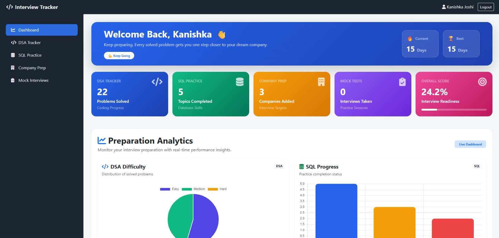
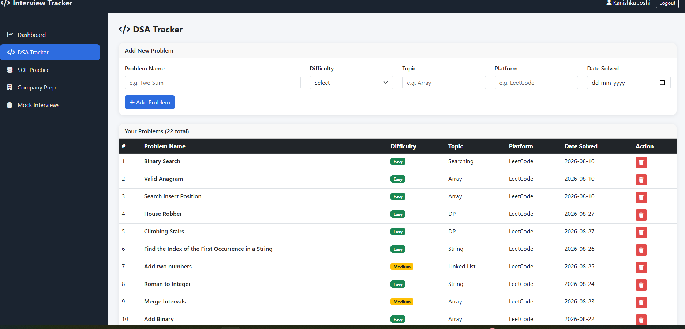
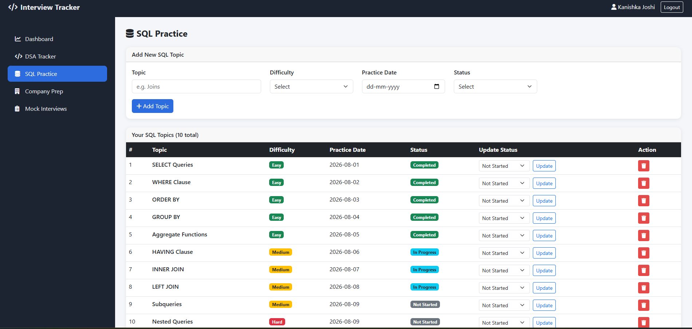
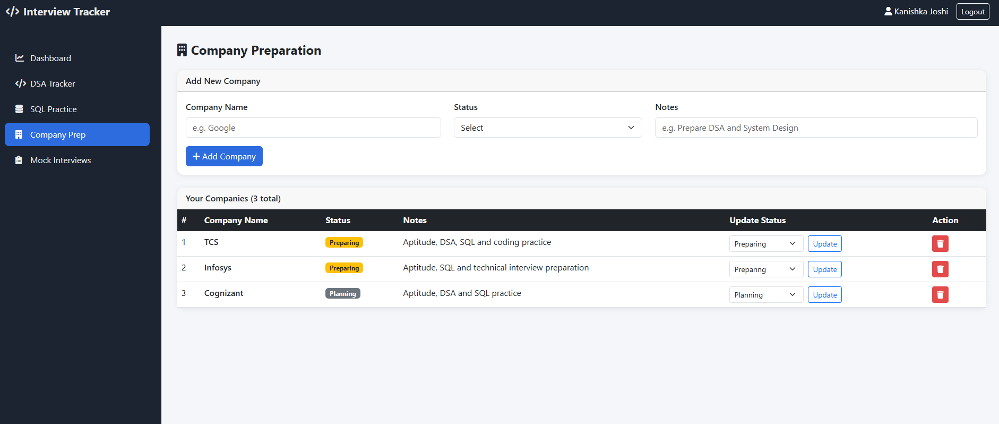

# 🚀 PrepTrack

**PrepTrack** is a personal placement preparation and interview tracking web application built to organize technical preparation in one place.

It helps track **DSA topics, SQL practice, target companies, mock interviews, and overall preparation progress** through a simple dashboard.

## 📸 Screenshots

### Dashboard


### DSA Tracker


### SQL Tracker


### Company Preparation


## ✨ Features

* 📊 **Dashboard** — Get an overview of your preparation progress.
* 💻 **DSA Tracker** — Add DSA topics and track their difficulty, practice date, and status.
* 🗄️ **SQL Tracker** — Track SQL topics, difficulty levels, practice dates, and completion status.
* 🏢 **Company Preparation** — Maintain a list of target companies and track preparation status.
* 🎤 **Mock Interviews** — Keep track of mock interview preparation and progress.
* 📈 **Analytics** — View preparation-related progress and statistics.
* 🔐 **User Authentication** — Register and log in to your personal account.
* 📝 **Notes** — Add useful preparation notes for companies.
* 🔄 **Status Management** — Update preparation status as progress changes.

## 🛠️ Tech Stack

| Technology | Purpose                   |
| ---------- | ------------------------- |
| Python     | Backend programming       |
| Flask      | Web framework             |
| HTML       | Page structure            |
| CSS        | Styling and UI            |
| JavaScript | Client-side functionality |
| Jinja2     | Template rendering        |
| SQLite     | Database                  |

## 📂 Project Structure

```text
PrepTrack/
│
├── app/
│   ├── templates/
│   │   ├── analytics.html
│   │   ├── base.html
│   │   ├── company.html
│   │   ├── dashboard.html
│   │   ├── dsa.html
│   │   ├── login.html
│   │   ├── mock.html
│   │   ├── register.html
│   │   └── sql.html
│   │
│   ├── __init__.py
│   ├── models.py
│   └── routes.py
│
├── static/
│   ├── css/
│   │   └── style.css
│   └── js/
│
├── config.py
├── create_db.py
├── run.py
├── requirements.txt
├── .gitignore
└── README.md
```

## ⚙️ Installation & Setup

### 1. Clone the repository

```bash
git clone https://github.com/Kanishka-sketch/PrepTrack.git
cd PrepTrack
```

### 2. Create a virtual environment

```bash
python -m venv venv
```

For Windows:

```bash
venv\Scripts\activate
```

### 3. Install dependencies

```bash
pip install -r requirements.txt
```

### 4. Create the database

```bash
python create_db.py
```

### 5. Run the application

```bash
python run.py
```

Open your browser and visit:

```text
http://127.0.0.1:5000
```

## 📖 How It Works

### 💻 DSA Preparation

The DSA tracker allows you to record topics and monitor your practice progress.

Example topics:

* Arrays
* Strings
* Linked Lists
* Stack & Queue
* Trees
* Graphs
* Dynamic Programming

### 🗄️ SQL Preparation

The SQL tracker helps organize SQL concepts according to difficulty and practice status.

Example topics:

* SELECT Queries
* WHERE Clause
* GROUP BY
* HAVING
* JOINs
* Subqueries
* CTEs
* Window Functions

### 🏢 Company Preparation

Add companies you are targeting and maintain their preparation status.

Example:

| Company   | Status      |
| --------- | ----------- |
| TCS       | In Progress |
| Infosys   | In Progress |
| Accenture | In Progress |
| Deloitte  | Not Started |
| Amazon    | Not Started |

You can also add notes such as the topics or interview areas that need more preparation.

### 🎤 Mock Interviews

The mock interview section helps keep track of interview practice and preparation activities.

## 🎯 Why I Built This

I built **PrepTrack** to organize my placement preparation in one place.

While preparing for technical interviews, I wanted a simple way to track my **DSA and SQL practice, target companies, mock interviews, and overall progress** instead of managing everything separately.

The project also gave me an opportunity to practice building a complete web application using **Python, Flask, HTML, CSS, JavaScript, and SQLite**.

## 🔮 Future Improvements

* [ ] Add coding problem tracking
* [ ] Add more detailed analytics and progress charts
* [ ] Add reminders for pending topics
* [ ] Add preparation deadlines
* [ ] Add search and filtering
* [ ] Add company-wise preparation plans
* [ ] Add interview experience tracking
* [ ] Improve mobile responsiveness
* [ ] Deploy the application online

## 👩‍💻 Author

**Kanishka Joshi**

A personal project built to organize and improve placement preparation.

---

⭐ If you find this project useful, feel free to star the repository.
